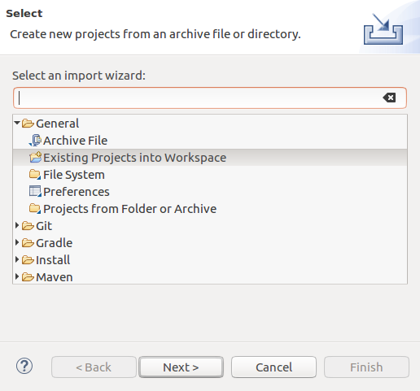

# UML Intro Repository
This repository contains code referenced by the UML Intro homework assignment.

Each package is referenced by a question on the homework. These packages can be viewed this GitHub page:

* [command](tree/master/src/command)
* [geese](tree/master/src/geese)
* [observer](tree/master/src/observer)
* [strategy](tree/master/src/strategy)
* [visitor](tree/master/src/visitor) (_extra credit_)


## Using Eclipse
This repository is configured as an Eclipse project and should import easily.

  1. Clone the code onto your computer using ```git clone```
  2. In Eclipse, from the main menu bar, select `File > Import...` to open the import wizard (see below).

 

 * Select the directory you created when cloning the code in Step 1 (i.e., `<CS471-Assignments-UMLIntro>`).
 * Click `Finish`
 
Refer to the offical Eclipse [help documentation](http://help.eclipse.org/oxygen/index.jsp?topic=%2Forg.eclipse.platform.doc.user%2Ftasks%2Ftasks-importproject.htm) for more details about importing a project into Eclipse.

